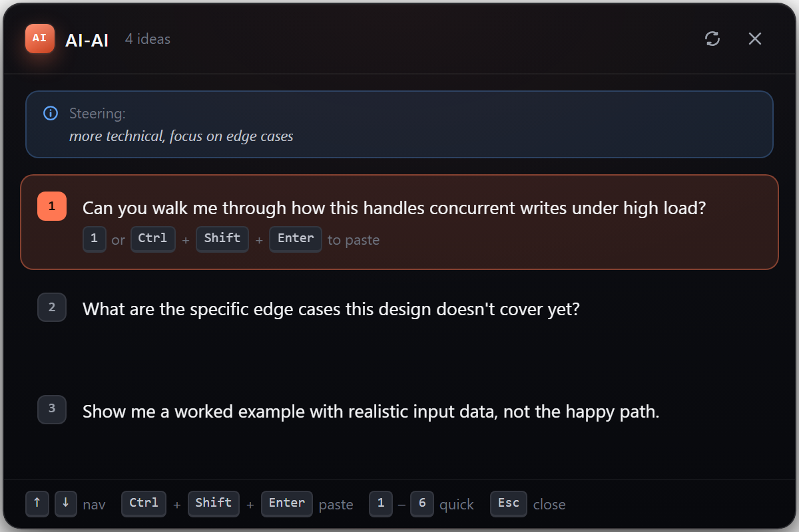
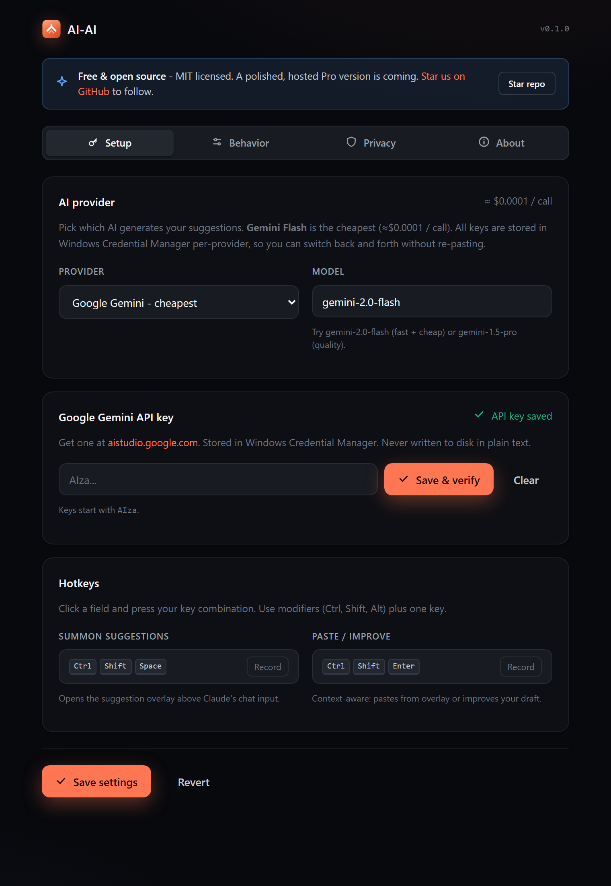
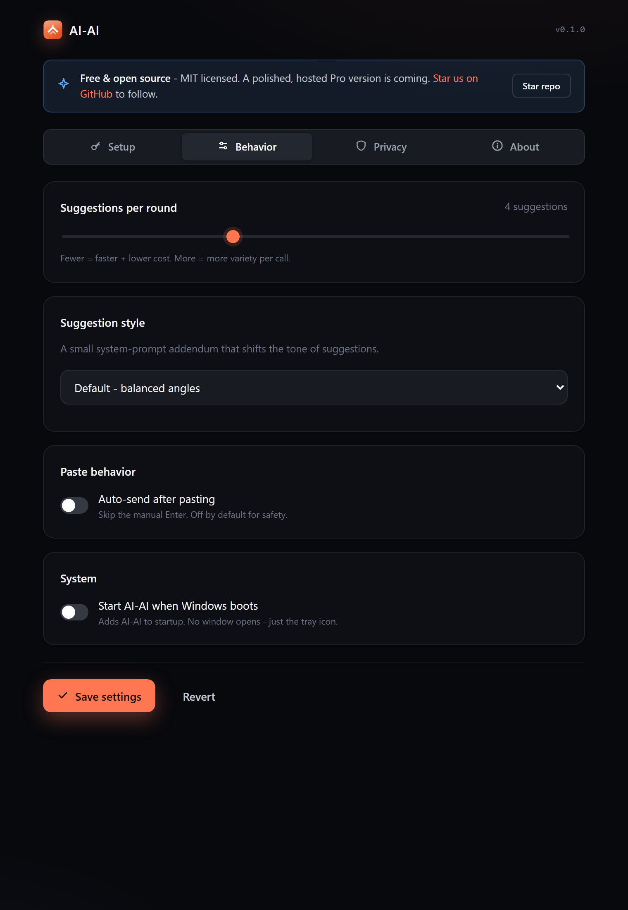
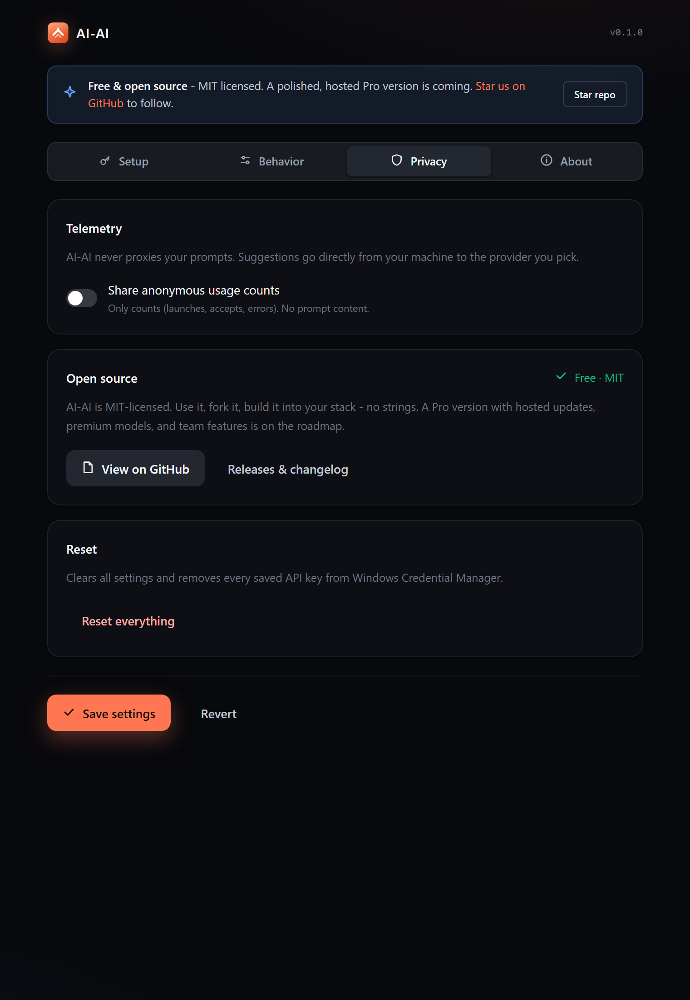

<p align="center">
  
</p>

<h3 align="center">
  Never stare at a blank prompt again.
</h3>

<p align="center">
  AI-AI sits in your Windows tray. Hit a hotkey - it reads your last Claude response and<br/>
  suggests what to ask next. Hit another - it sharpens the draft you're already typing.
</p>

<p align="center">
  <a href="https://github.com/RemielDev/ai-ai/releases/latest"></a>
  <a href="LICENSE"></a>
  <a href="https://github.com/RemielDev/ai-ai/stargazers"></a>
</p>

<p align="center">
  
  
  
  
</p>

---

## What it does

You're deep in a Claude conversation. The response just landed. You want to keep going, but you don't know what to ask next - or you're typing something and want it sharper.

**`Ctrl` + `Shift` + `Space`** - overlay above your chat input with 3–6 follow-up prompts. Arrow keys to pick. `Ctrl` + `Shift` + `Enter` pastes it.

**`Ctrl` + `Shift` + `Enter`** *(while typing in Claude)* - your draft is rewritten in place as a clearer, more specific prompt.

That's it. Two hotkeys, one tray icon. Your keys, your wallet - AI-AI never proxies anything.

<table>
  <tr>
    <td></td>
    <td></td>
  </tr>
  <tr>
    <td align="center"><em>Overlay anchored above Claude's chat input</em></td>
    <td align="center"><em>Pick a provider, paste a key, you're done</em></td>
  </tr>
</table>

## Install

> Note: a v0.1.0 GitHub release with a signed installer is on the way. Until then, build from source (it takes ~3 min, instructions below).

```powershell
git clone https://github.com/RemielDev/ai-ai
cd ai-ai
cargo install tauri-cli --version "^2.0"
cargo tauri build
# Installer: src-tauri\target\release\bundle\nsis\AI-AI_0.1.0_x64-setup.exe
```

Run the installer (per-user, no admin needed). On first launch, a 4-step wizard walks you through:

1. Welcome
2. Pick a provider
3. Paste your API key
4. Done - try `Ctrl + Shift + Space` in Claude

## Pick any AI provider

Each provider's key is stored in its own Windows Credential Manager entry. Save keys for all four; flip between them with a dropdown.

| Provider | Default model | Per-call cost | Get a key |
|---|---|---|---|
| **Google Gemini** *(default)* | `gemini-2.0-flash` | ≈ **$0.0001** | [aistudio.google.com](https://aistudio.google.com/apikey) |
| OpenAI | `gpt-4o-mini` | ≈ $0.0003 | [platform.openai.com](https://platform.openai.com/api-keys) |
| OpenRouter | various, free tier | $0 – $0.001 | [openrouter.ai](https://openrouter.ai/keys) |
| Anthropic | `claude-haiku-4-6` | ≈ $0.001 | [console.anthropic.com](https://console.anthropic.com/settings/keys) |

For most users: pick **Gemini Flash**. A heavy day of suggestions costs less than a coffee.

## Why it feels different from other prompt tools

- **Context-aware** - anything you've already typed in Claude's chat box biases the suggestions toward that direction.
- **Variation seed** - re-summon with unchanged context and the suggestions explicitly avoid repeating prior ideas. No echo chamber.
- **Rate-limited by default** - per-action cooldowns + a 60-call-per-minute hard cap so a stuck hotkey can't cost you $400.
- **Drops out of the way** - overlay anchors above Claude's chat input via Windows UI Automation, dismisses on Esc, never steals focus permanently.
- **Accessible** - WCAG AA contrast, full keyboard nav, ARIA listbox semantics, `prefers-reduced-motion` honored.
- **Tiny** - ~2.3 MB NSIS installer, ~80 MB idle memory.

## Configure (Settings tab walkthrough)

<table>
  <tr>
    <td width="50%"></td>
    <td width="50%"></td>
  </tr>
  <tr>
    <td><strong>Behavior</strong> - suggestions per round (3–6), style preset (Default / Concise / Exploratory / Technical), auto-send after paste, start on Windows boot.</td>
    <td><strong>Privacy</strong> - telemetry opt-in (anonymous counts only, no prompt content), open-source notice, full reset.</td>
  </tr>
</table>

## How it works under the hood

```
┌──────────────────────────────────────────────────────────────┐
│ AI-AI (Rust + Tauri 2)                                       │
│                                                              │
│   ┌──────────────┐   ┌──────────────┐   ┌─────────────┐     │
│   │ HotkeyDaemon │ → │ ClaudeReader │ → │  Suggester  │     │
│   │   (global)   │   │   (UIA)      │   │ (4 BYOK)    │     │
│   └──────────────┘   └──────────────┘   └─────────────┘     │
│          ↓                                      ↓            │
│   ┌──────────────┐                      ┌─────────────┐     │
│   │   Injector   │ ← ──── selected ──── │ Overlay UI  │     │
│   │ (paste/send) │                      │ (Tauri web) │     │
│   └──────────────┘                      └─────────────┘     │
└──────────────────────────────────────────────────────────────┘
```

Five units, one job each:

| File | What it does |
|---|---|
| [`src-tauri/src/hotkey.rs`](src-tauri/src/hotkey.rs) | Registers global shortcuts, dispatches by focused window, enforces rate limits |
| [`src-tauri/src/reader.rs`](src-tauri/src/reader.rs) | Walks Claude Desktop's UI Automation tree, returns a `ChatSnapshot` |
| [`src-tauri/src/suggester.rs`](src-tauri/src/suggester.rs) | Normalizes 4 different API shapes (Anthropic, OpenAI, OpenRouter, Gemini) |
| [`src-tauri/src/injector.rs`](src-tauri/src/injector.rs) | Pastes into Claude's chat box via UIA `SetValue` with clipboard fallback |
| [`ui/`](ui/) | Static HTML/CSS/JS. No build step - just files. |

Full design doc: [`docs/superpowers/specs/2026-05-24-ai-ai-design.md`](docs/superpowers/specs/2026-05-24-ai-ai-design.md)

## Roadmap

- [x] Windows v0.1.0 - 4 providers, full state coverage, rate limiting, autostart, MIT
- [ ] First signed installer release (v0.1.0)
- [ ] Per-conversation memory - remember which angles you've already explored
- [ ] macOS port (UIA → AXUIElement on macOS, same Suggester / Overlay)
- [ ] Web-Claude support via a Chrome extension companion
- [ ] **AI-AI Pro** *(separate paid product)* - hosted updates, premium presets, team workspace, priority support

## Contributing

PRs welcome. The codebase is small and the units are isolated - a focused fix or feature usually touches one file. Check [`TESTING.md`](TESTING.md) for the dev loop, then open an issue describing what you want to change before sending the PR.

## Privacy

- Your prompts go from your machine **directly** to the provider you picked, with your key. AI-AI has no servers.
- API keys live in **Windows Credential Manager**, never on disk in plain text.
- Telemetry is **opt-in**. Even when on, it ships anonymous counters (launches, accepts, errors). Never prompt content.

## Acknowledgements

Independent project, not affiliated with Anthropic, OpenAI, OpenRouter, or Google. "Claude" is a trademark of Anthropic. Built with [Tauri](https://tauri.app), [Rust](https://www.rust-lang.org), and the providers' APIs.

## License

[MIT](LICENSE) - use it, fork it, ship it.

<p align="center">
  <sub>Built with care by <a href="https://github.com/RemielDev">@RemielDev</a></sub>
</p>
