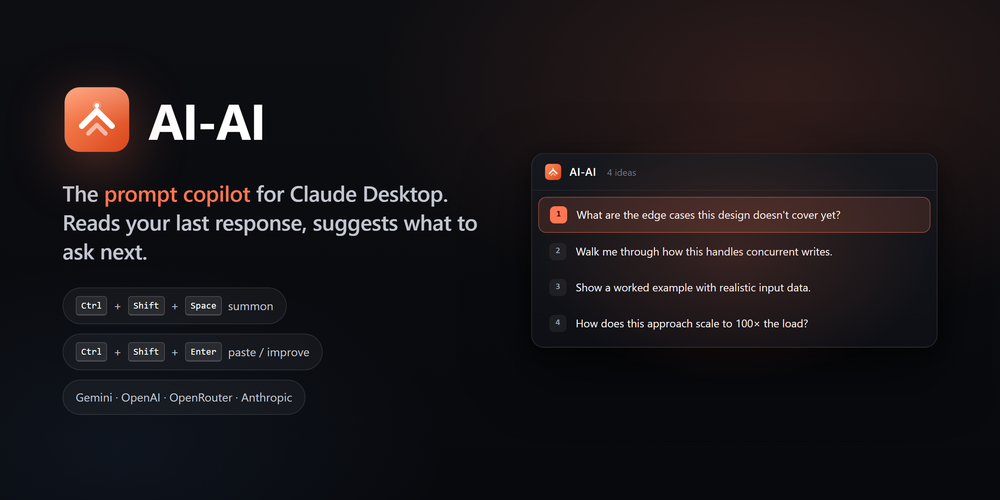

<p align="center">
  
</p>

<p align="center">
  <a href="https://github.com/RemielDev/ai-ai/releases"></a>
  <a href="LICENSE"></a>
  
  
</p>

---

A Windows tray app that lives next to Claude Desktop. Two hotkeys, one purpose: stop staring at the chat input wondering what to ask next.

- **`Ctrl + Shift + Space`** — reads your most recent Claude response, generates 3–6 follow-up prompts in a floating overlay above the chat input. Arrow keys to pick. `Ctrl + Shift + Enter` to paste.
- **`Ctrl + Shift + Enter`** (typing in Claude) — rewrites your draft prompt as a sharper, clearer version, in place.

Bring your own API key. Prompts go directly from your machine to the provider you pick. AI-AI never proxies them.

## Providers — pick one, switch anytime

| Provider | Default model | Per-call cost | Where to get a key |
|---|---|---|---|
| **Google Gemini** *(default)* | `gemini-2.0-flash` | ≈ $0.0001 | [aistudio.google.com/apikey](https://aistudio.google.com/apikey) |
| OpenAI | `gpt-4o-mini` | ≈ $0.0003 | [platform.openai.com/api-keys](https://platform.openai.com/api-keys) |
| OpenRouter | various, free tier | $0 — $0.001 | [openrouter.ai/keys](https://openrouter.ai/keys) |
| Anthropic | `claude-haiku-4-6` | ≈ $0.001 | [console.anthropic.com](https://console.anthropic.com/settings/keys) |

Each provider's key is stored in its own Windows Credential Manager entry. Save keys for all four; flip between them with one dropdown.

## Install

Download the latest `AI-AI_x.x.x_x64-setup.exe` from [Releases](https://github.com/RemielDev/ai-ai/releases) and run it. Per-user install — no admin needed.

On first launch, a 4-step wizard walks you through provider + key. Tray icon appears. Open Claude Desktop, hit `Ctrl + Shift + Space`.

## Features

- **4 AI providers** — Gemini Flash / OpenAI / OpenRouter / Anthropic
- **Context-aware hotkey** — the same `Ctrl + Shift + Enter` pastes from overlay OR improves your draft, depending on which window is focused
- **Steering** — anything you've already typed in Claude's chat box biases the suggestions toward that direction
- **Variation** — re-summon with unchanged context and the suggestions explicitly avoid repeating prior ones
- **Rate limited** — 60 calls / minute hard cap + per-action cooldowns prevent runaway cost from misfires
- **Trial-aware** — 7-day trial, then app keeps working but updates require a license
- **Configurable** — hotkey recorder widget, style presets (Default / Concise / Exploratory / Technical), auto-send toggle, autostart on boot
- **Accessible** — WCAG AA contrast, ARIA listbox semantics, keyboard nav, `prefers-reduced-motion` honored
- **Tiny** — ~2.3 MB NSIS installer, ~7 MB exe

## How it works

```
┌──────────────────────────────────────────────────────────────┐
│  AI-AI (Rust + Tauri 2)                                      │
│                                                              │
│   ┌──────────────┐   ┌──────────────┐   ┌─────────────┐     │
│   │ HotkeyDaemon │ → │ ClaudeReader │ → │  Suggester  │     │
│   │  (global)    │   │   (UIA)      │   │ (4 BYOK)    │     │
│   └──────────────┘   └──────────────┘   └─────────────┘     │
│          ↓                                      ↓            │
│   ┌──────────────┐                      ┌─────────────┐     │
│   │   Injector   │ ← ──── selected ──── │ Overlay UI  │     │
│   │ (paste/send) │                      │ (Tauri web) │     │
│   └──────────────┘                      └─────────────┘     │
└──────────────────────────────────────────────────────────────┘
```

Five units, each one Rust file:

| Unit | Job |
|---|---|
| `src-tauri/src/hotkey.rs` | Register global hotkeys, dispatch by focused window, rate-limit |
| `src-tauri/src/reader.rs` | Walk Claude Desktop's UI Automation tree, extract chat snapshot |
| `src-tauri/src/suggester.rs` | Dispatch to Anthropic / OpenAI / OpenRouter / Gemini APIs |
| `src-tauri/src/injector.rs` | Paste via UIA SetValue (clipboard fallback), optional auto-send |
| `src-tauri/src/lib.rs` + `ui/` | Tauri tray, overlay, settings, onboarding |

## Build from source

Requirements: Windows 10/11, Rust 1.77+, MSVC build tools, Node.js 18+, WebView2 Runtime (preinstalled on Windows 11).

```powershell
cargo install tauri-cli --version "^2.0"
git clone https://github.com/RemielDev/ai-ai
cd ai-ai
cargo tauri build
```

Installer lands in `src-tauri/target/release/bundle/nsis/`.

## Testing

See [`TESTING.md`](TESTING.md) for the iteration loop and 10-step manual checklist.

UI mockups can be regenerated any time:

```powershell
node dev-preview/snap.mjs
```

Outputs 12 PNGs to `mockups/`, covering every state (loading / suggestions / error / empty) and every screen (4 settings tabs / 4 onboarding steps / about).

## Privacy

- Prompts never touch our servers. They go from your machine to the API provider you picked, with your key.
- API keys are stored in Windows Credential Manager. Never written to disk in plain text.
- Telemetry is opt-in and ships only anonymous counters (launches, accepts, errors). Never prompt content.

## Acknowledgements

AI-AI is independent and not affiliated with Anthropic, OpenAI, OpenRouter, or Google. "Claude" is a trademark of Anthropic. Built with [Tauri](https://tauri.app), [Rust](https://www.rust-lang.org), and the providers' APIs.

## License

Proprietary. Source available for transparency; redistribution requires permission.
